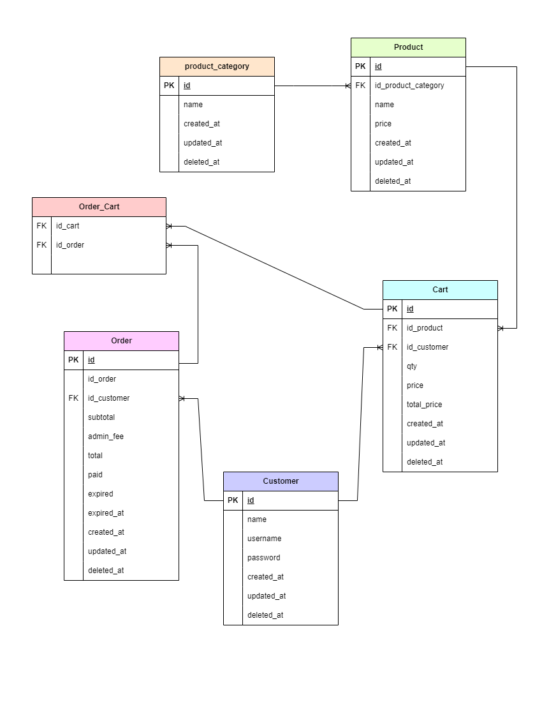

<h1 align="center">
  Synapsis Project
  <br>
</h1>

<h4 align="center"> Synapsis Project is a Online Store Application, users can make transaction in this app </h4>
       
## Build App & Database


## ⚙️ Installing and Running from Github

Installing and running the app from github repository <br>
To clone and run this application, you'll need [Git](https://git-scm.com) and [Golang](https://go.dev/dl/) installed on your computer. From your command line:

```bash
# Clone this repository
$ git clone https://github.com/vaniliacahya/synapsis-project.git

# Go into the repository
$ cd synapsis-project

# Run the app
$ go run main.go
```

## Feature

- Customers <br>
This feature consist endpoint register for new customer, and login as a customer
  
| Customer | Endpoint | Param | JWT Token | Function |
| --- | --- | --- | --- | --- |
| `POST` | /register | - | NO | Feature register for new customer |
| `POST` | /login | - | NO | Feature login customer |


- Products <br>
This feature consist endpoint view product
  
| Product | Endpoint | Param | JWT Token | Function |
| --- | --- | --- | --- | --- |
| `GET` | /products | - | NO | Feature for customer to view product |


- Carts <br>
This feature consist endpoint to add, update, delete or get cart customer
  
| Cart | Endpoint | Param | JWT Token | Function |
| --- | --- | --- | --- | --- |
| `POST` | /carts | - | YES | Feature for customer to add or update product in cart |
| `GET` | /carts | - | YES | Feature for customer to get carts |
| `DELETE` | /carts | /:id | YES | Feature for customer to delete product in cart |

- Order <br>
This feature consist endpoint order
  
| Order | Endpoint | Param | JWT Token | Function |
| --- | --- | --- | --- | --- |
| `POST` | /checkout | - | YES | Feature for customer to make an order |

## ERD


## Authors

Vanilia Cahya Nugroho
       
  Reach me:

  
  [](https://github.com/vaniliacahya)
  [](https://www.linkedin.com/in/vaniliacahya/)
  [](https://api.whatsapp.com/send/?phone=%2B6281249690397&text=Hello&type=phone_number&app_absent=0)

       
 <p align="right">(<a href="#top">back to top</a>)</p>
<h3>
<p align="center">:copyright: 2022 </p>
</h3>
<!-- end -->
